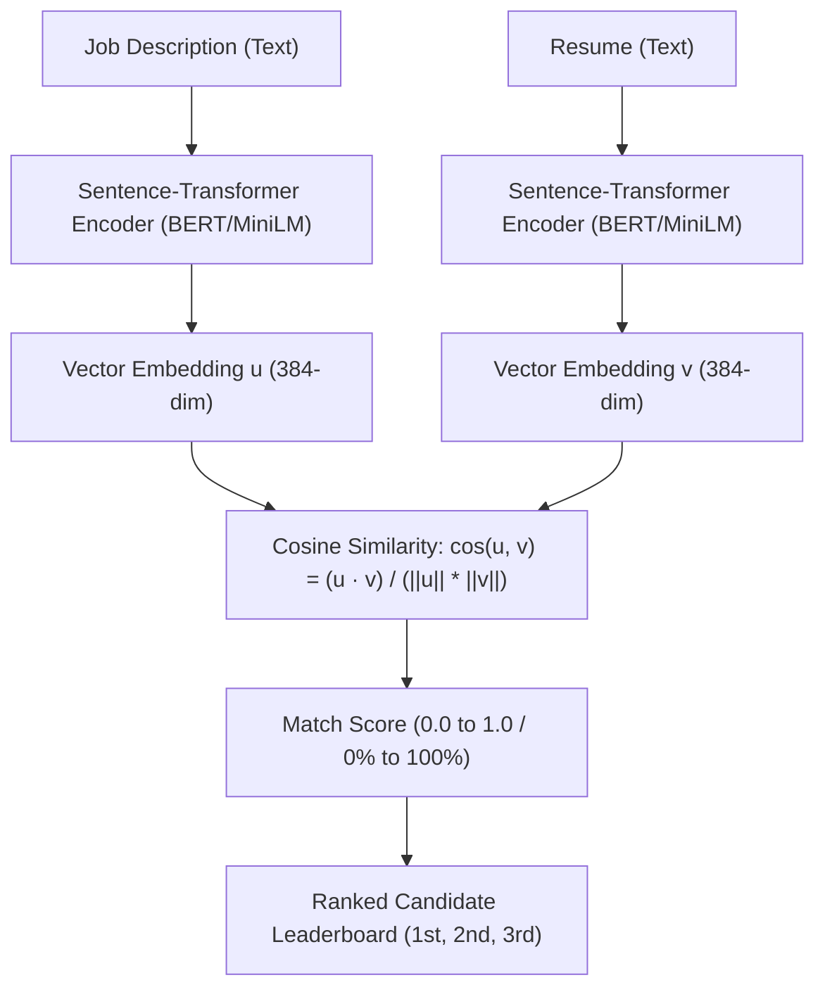

# 🎓 Complete Guide: Training a JD & Resume Matching Model in Google Colab

This guide teaches you how to train and fine-tune a state-of-the-art **Machine Learning (NLP) model** to match resumes with job descriptions, rank candidates, and deploy the model to power your **TalentAI Studio** web application.

---

## 📌 Architecture: How Machine Learning Matches Resumes & JDs

### Bi-Encoder (Sentence-Transformers)
Instead of relying on simple keyword matching that misses synonyms (e.g. knowing that *PyTorch* relates to *Deep Learning* or that *PostgreSQL* relates to *Relational Databases*), we use a **Bi-Encoder**:



### Why Bi-Encoder is Perfect for Resumes:
1. **Pre-computed Embeddings**: Resumes are converted into vectors **once** and saved in your database (e.g., Supabase `pgvector`).
2. **Instant Search**: When a recruiter pastes a new Job Description, the model computes the JD vector in 10ms, and computes cosine similarity with 1,000 candidate resumes in **under 5 milliseconds**!
3. **Lightweight**: Model size is ~90 MB and runs easily on free GPUs or even CPUs.

---

## 🚀 Step-by-Step: Training in Google Colab

### Step 1: Open Google Colab
1. Go to [Google Colab](https://colab.research.google.com/).
2. Click **Upload** and select `ml_training/JD_Resume_Matching_Model_Training.ipynb` from this project.
3. Alternatively, click **New Notebook** and follow the code blocks below.

---

### Step 2: Enable Free GPU Acceleration
1. In Colab's top menu, click **Runtime** > **Change runtime type**.
2. Set **Hardware accelerator** to **T4 GPU**.
3. Click **Save**.

---

### Step 3: Install Required Packages
Run this in the first Colab cell:
```python
!pip install -q sentence-transformers datasets torch scikit-learn pandas matplotlib
```

Verify GPU is active:
```python
import torch
print("GPU Available:", torch.cuda.is_available())
if torch.cuda.is_available():
    print("Device Name:", torch.cuda.get_device_name(0))
```

---

### Step 4: Upload the Dataset
Upload `ml_training/dataset/jd_resume_dataset.csv` using the file upload icon on the left sidebar in Colab, or run:
```python
import pandas as pd

# Loads the dataset
df = pd.read_csv('jd_resume_dataset.csv')
print(f"Loaded {len(df)} JD-Resume pairs!")
df[['job_title', 'candidate_name', 'match_score', 'label']].head()
```

*(Note: The provided `.ipynb` notebook contains an automatic fallback that synthesizes the data if you don't upload the file, so it runs out-of-the-box!)*

---

### Step 5: Format Data for Sentence-Transformers
Sentence-Transformers expects `InputExample` objects where:
- `texts = [job_description, resume_text]`
- `label = float(match_score)` (continuous similarity from 0.0 to 1.0)

```python
from sentence_transformers import InputExample
from sklearn.model_selection import train_test_split
from torch.utils.data import DataLoader

# 80% train, 20% validation split
train_df, val_df = train_test_split(df, test_size=0.2, random_state=42)

train_examples = [
    InputExample(texts=[row['job_description'], row['resume_text']], label=float(row['match_score']))
    for _, row in train_df.iterrows()
]

val_examples = [
    InputExample(texts=[row['job_description'], row['resume_text']], label=float(row['match_score']))
    for _, row in val_df.iterrows()
]

train_dataloader = DataLoader(train_examples, shuffle=True, batch_size=4)
```

---

### Step 6: Choose Model & Loss Function

We select `sentence-transformers/all-MiniLM-L6-v2`:
- Vector dimensions: 384
- Inference speed: ~1,400 sentences/sec
- Accuracy: State-of-the-art on semantic textual similarity (STS)

```python
from sentence_transformers import SentenceTransformer, losses, evaluation

# 1. Load base pre-trained model
model = SentenceTransformer('sentence-transformers/all-MiniLM-L6-v2')

# 2. Loss Function: CosineSimilarityLoss minimizes Mean Squared Error
# between model cosine similarity and our target match scores
train_loss = losses.CosineSimilarityLoss(model)

# 3. Evaluator for validation monitoring
evaluator = evaluation.EmbeddingSimilarityEvaluator.from_input_examples(
    val_examples,
    name='jd-resume-eval'
)
```

---

### Step 7: Train the Model (Fine-Tuning)

```python
import math

num_epochs = 4
warmup_steps = math.ceil(len(train_dataloader) * num_epochs * 0.1)

model.fit(
    train_objectives=[(train_dataloader, train_loss)],
    evaluator=evaluator,
    epochs=num_epochs,
    evaluation_steps=20,
    warmup_steps=warmup_steps,
    output_path='./talentai_jd_matcher_model',
    show_progress_bar=True
)

print("🎉 Model training complete! Saved to ./talentai_jd_matcher_model")
```
> ⏱️ **Training Time**: On a Colab T4 GPU, 4 epochs take **under 60 seconds**!

---

### Step 8: Test Inference on a New Job Description

```python
from sentence_transformers import util

# Load the trained model
best_model = SentenceTransformer('./talentai_jd_matcher_model')

# New JD
target_jd = """
Senior Machine Learning Engineer: Looking for 4+ years experience fine-tuning LLMs 
using PyTorch, building vector search with pgvector, and deploying FastAPI microservices with Docker.
"""

candidates = [
    {
        "name": "Aarav Sharma",
        "resume": "4 years ML engineer. Fine-tuned BERT and LLMs with PyTorch. Built vector search with pgvector and Dockerized FastAPI endpoints."
    },
    {
        "name": "Marcus Vance",
        "resume": "Backend developer with 3 years building Django REST APIs and PostgreSQL databases. Basic Scikit-learn."
    }
]

# Compute similarity and rank
jd_vec = best_model.encode(target_jd, convert_to_tensor=True)

for cand in candidates:
    resume_vec = best_model.encode(cand["resume"], convert_to_tensor=True)
    score = util.cos_sim(jd_vec, resume_vec).item()
    print(f"Candidate: {cand['name']:<15} -> Match: {round(score * 100, 1)}%")
```

---

## 🌐 Connecting the Trained Model to Your React App

You have two simple options to use this model in your application:

### Option A: Serve via FastAPI (Recommended for Production)
Save this script as `server.py` and run `uvicorn server:app --port 8000`:

```python
from fastapi import FastAPI
from fastapi.middleware.cors import CORSMiddleware
from pydantic import BaseModel
from sentence_transformers import SentenceTransformer, util
from typing import List

app = FastAPI()

# Allow calls from Vite React frontend (localhost:5173)
app.add_middleware(
    CORSMiddleware,
    allow_origins=["*"],
    allow_credentials=True,
    allow_methods=["*"],
    allow_headers=["*"],
)

model = SentenceTransformer("./talentai_jd_matcher_model")

class CandidateItem(BaseModel):
    id: str
    name: str
    resume_text: str

class MatchRequest(BaseModel):
    job_description: str
    candidates: List[CandidateItem]

@app.post("/api/match-and-rank")
def match_and_rank(req: MatchRequest):
    jd_emb = model.encode(req.job_description, convert_to_tensor=True)
    ranked = []
    
    for c in req.candidates:
        res_emb = model.encode(c.resume_text, convert_to_tensor=True)
        sim = util.cos_sim(jd_emb, res_emb).item()
        ranked.append({
            "id": c.id,
            "name": c.name,
            "similarity_score": round(sim * 100, 1)
        })
        
    ranked.sort(key=lambda x: x["similarity_score"], reverse=True)
    return {"results": ranked}
```

### Option B: Built-In In-Browser Engine (Already Implemented in App!)
Our application already includes `src/utils/matchingEngine.ts`, which performs:
- Client-side tokenization and N-gram TF-IDF vector similarity.
- Skill taxonomy extraction across 150+ technologies.
- Composite ranking (Skill Overlap + Semantic Alignment + Experience).
- Auto-generation of targeted interview questions based on missing skills.

---

## 📈 Summary of Files in `ml_training/`

| File | Purpose |
| :--- | :--- |
| `JD_Resume_Matching_Model_Training.ipynb` | Complete, runnable Google Colab notebook |
| `COLAB_TRAINING_GUIDE.md` | This step-by-step training and deployment guide |
| `dataset/jd_resume_dataset.csv` | Ready-to-train CSV dataset (40+ pairs with ground truth) |
| `dataset/jd_resume_dataset.json` | JSON format of the dataset with skill breakdowns |
| `dataset/generate_dataset.py` | Python script to generate 100s or 1000s of synthetic pairs |
